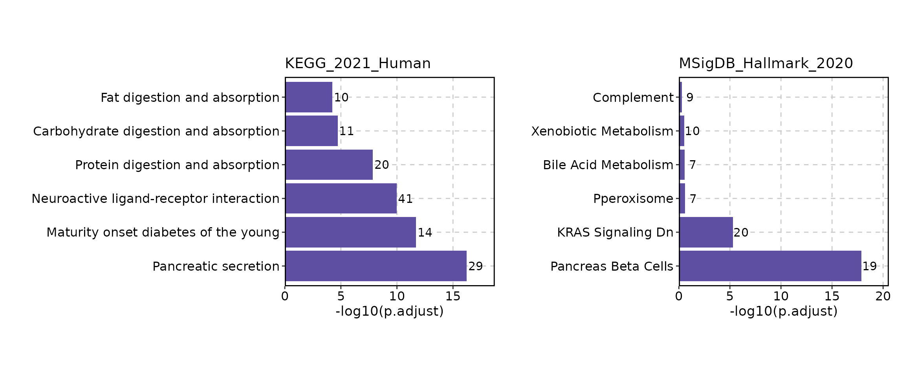
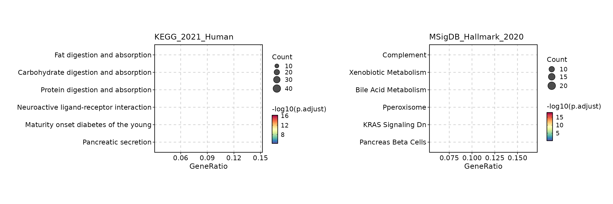

# Over-representation Enrichment Analysis

``` r
library(enrichit)
# devtools::install_github("pwwang/scplotter")
library(scplotter)
```

## Introduction

This vignette demonstrates how to perform over-representation enrichment
analysis using the `enrichit` package. The package provides a convenient
way to analyze gene sets against custom gene sets (GMT files) and
supports both `clusterProfiler` and `enrichr` styles of analysis.

The package is designed to work offline, making it suitable for
environments with limited internet access. Additionally, it seamlessly
integrates with the [`scplotter`](https://github.com/pwwang/scplotter)
package for visualization.

## Installation

You can install the development version of `enrichit` from GitHub with:

``` r
# install.packages("devtools")
devtools::install_github("pwwang/enrichit")
# remotes::install_github("pwwang/enrichit")
```

## Data preparation

### Load example data

The example data used in this vignette is included in the package. You
can load it using the following command:

``` r
data(userlist)
```

For this example, we will use the `userlist` data, which contains a list
of genes of interest. The data is a character vector of gene symbols.
You can replace this with your own gene list. They don’t have to be gene
symbols, but they should match the gene names in the GMT files you are
using for analysis.

### Load GMT files

The `enrichit` package comes with built-in GMT files for BioCarta, GO,
KEGG, MSigDB Hallmark, Reactome pathways and WikiPathways. You can find
these files in the `extdata` directory of the package. You can find more
public GMT files in the
[MSigDB](https://www.gsea-msigdb.org/gsea/msigdb/) database or the
[`enrichr`](https://maayanlab.cloud/Enrichr/) database. You can also use
your own custom GMT files.

To load the GMT files, you can use the following commands:

``` r

kegg_gmt <- system.file("extdata", "KEGG_2021_Human.gmt.gz", package = "enrichit")
hallmark_gmt <- system.file("extdata", "MSigDB_Hallmark_2020.gmt.gz", package = "enrichit")

pathways <- ParseGMT(kegg_gmt)
pathways[1:2]
#> $`ABC transporters`
#>  [1] "ABCA2"  "ABCC4"  "ABCG8"  "ABCA3"  "ABCC5"  "ABCC2"  "ABCA1"  "ABCC3" 
#>  [9] "ABCA6"  "ABCC8"  "ABCA7"  "ABCC9"  "ABCA4"  "ABCC6"  "ABCA5"  "TAP2"  
#> [17] "ABCA8"  "TAP1"   "ABCA9"  "ABCA10" "ABCB10" "ABCA12" "ABCB11" "ABCC10"
#> [25] "ABCG1"  "ABCG4"  "ABCC1"  "ABCG5"  "ABCG2"  "CFTR"   "ABCB4"  "ABCB1" 
#> [33] "ABCD3"  "ABCD4"  "ABCB7"  "ABCB8"  "ABCB5"  "ABCB6"  "ABCB9"  "ABCA13"
#> [41] "ABCC11" "ABCC12" "DEFB1"  "ABCD1"  "ABCD2" 
#> 
#> $`AGE-RAGE signaling pathway in diabetic complications`
#>   [1] "TGFB1"    "TGFB3"    "TGFB2"    "VCAM1"    "AGT"      "MAPK13"  
#>   [7] "MAPK14"   "COL1A2"   "MAPK11"   "COL1A1"   "MAPK12"   "MAPK10"  
#>  [13] "AGTR1"    "BAX"      "PLCD1"    "PLCD4"    "PLCD3"    "RELA"    
#>  [19] "SERPINE1" "TNF"      "FOXO1"    "NRAS"     "CCND1"    "AKT3"    
#>  [25] "AKT1"     "PLCE1"    "AKT2"     "EGR1"     "SMAD3"    "STAT5B"  
#>  [31] "SMAD2"    "SMAD4"    "PRKCD"    "PRKCE"    "CYBB"     "PRKCB"   
#>  [37] "PRKCA"    "SELE"     "NFKB1"    "DIAPH1"   "PRKCZ"    "PIK3R1"  
#>  [43] "NOX4"     "NOX1"     "AGER"     "ICAM1"    "PIM1"     "PLCG1"   
#>  [49] "PLCG2"    "STAT5A"   "EDN1"     "JUN"      "MMP2"     "VEGFC"   
#>  [55] "FN1"      "VEGFD"    "NFATC1"   "TGFBR1"   "TGFBR2"   "VEGFA"   
#>  [61] "VEGFB"    "IL1A"     "IL1B"     "COL3A1"   "IL6"      "PIK3CB"  
#>  [67] "PIK3CA"   "CDK4"     "BCL2"     "CXCL8"    "PIK3R3"   "PIK3R2"  
#>  [73] "CASP3"    "NOS3"     "STAT1"    "STAT3"    "F3"       "CDC42"   
#>  [79] "COL4A1"   "PLCB4"    "COL4A3"   "COL4A2"   "COL4A5"   "COL4A4"  
#>  [85] "COL4A6"   "KRAS"     "PLCB2"    "PLCB3"    "PLCB1"    "CDKN1B"  
#>  [91] "PIK3CD"   "MAPK9"    "THBD"     "MAPK8"    "MAPK3"    "CCL2"    
#>  [97] "HRAS"     "MAPK1"    "RAC1"     "JAK2"
```

Specifying a URL of a GMT file is also supported. For example, you can
use the following command to load a GMT file from a URL:

``` r
# gmt_url <- "https://example.com/path/to/your/gmt/file.gmt"
# pathways <- ParseGMT(gmt_url)
```

Additionally, you can also use a name of a library from the
[`enrichr`](https://maayanlab.cloud/Enrichr/) database to load the GMT
file. If they are one of the built-in libraries (`BioCarta`,
`BioCarta_2016`, `GO_Biological_Process`, `GO_Biological_Process_2025`,
`GO_Cellular_Component`, `GO_Cellular_Component_2025`,
`GO_Molecular_Function`, `GO_Molecular_Function_2025`, `KEGG`,
`KEGG_2021`, `KEGG_Human`, `KEGG_2021_Human`, `Hallmark`,
`MSigDB_Hallmark`, `MSigDB_Hallmark_2020`, `Reactome`,
`Reactome_Pathways`, `Reactome_Pathways_2024`, `WikiPathways`,
`WikiPathways_2024`), the GMT file will be loaded from the package.
Otherwise, it will be downloaded from the
[`enrichr`](https://maayanlab.cloud/Enrichr/) database
[library](https://maayanlab.cloud/Enrichr/#libraries).

``` r
# Load built-in libraries
library_name <- "MSigDB_Hallmark"
hallmarks <- ParseGMT(library_name)
hallmarks[1:2]
#> $`TNF-alpha Signaling via NF-kB`
#>   [1] "MARCKS"   "IL23A"    "NINJ1"    "TNFSF9"   "SIK1"     "ATF3"    
#>   [7] "SERPINE1" "MYC"      "HES1"     "CCN1"     "CCNL1"    "EGR1"    
#>  [13] "EGR2"     "EGR3"     "JAG1"     "ABCA1"    "GADD45B"  "GADD45A" 
#>  [19] "KLF10"    "PLK2"     "EIF1"     "EHD1"     "FOSL2"    "FOSL1"   
#>  [25] "GPR183"   "PLPP3"    "IFIT2"    "ICAM1"    "ZC3H12A"  "IER2"    
#>  [31] "IL12B"    "IER5"     "JUNB"     "IER3"     "STAT5A"   "DUSP5"   
#>  [37] "EDN1"     "DUSP4"    "JUN"      "DUSP1"    "DUSP2"    "TSC22D1" 
#>  [43] "CCL20"    "SPHK1"    "LIF"      "IL18"     "TUBB2A"   "RHOB"    
#>  [49] "VEGFA"    "IL1A"     "PTPRE"    "TLR2"     "IL1B"     "BHLHE40" 
#>  [55] "CLCF1"    "ID2"      "REL"      "FJX1"     "SGK1"     "BTG3"    
#>  [61] "BTG2"     "BTG1"     "SDC4"     "LITAF"    "AREG"     "SOCS3"   
#>  [67] "PANX1"    "RIPK2"    "NFIL3"    "SERPINB2" "GCH1"     "IFNGR2"  
#>  [73] "G0S2"     "FOS"      "F3"       "SERPINB8" "SPSB1"    "FOSB"    
#>  [79] "PER1"     "F2RL1"    "HBEGF"    "CD44"     "TRIP10"   "CDKN1A"  
#>  [85] "PTGER4"   "PTGS2"    "IFIH1"    "NAMPT"    "OLR1"     "ICOSLG"  
#>  [91] "PHLDA1"   "ZBTB10"   "TAP1"     "PNRC1"    "CXCL10"   "CXCL11"  
#>  [97] "IL6ST"    "CD69"     "SQSTM1"   "RELA"     "CD83"     "CSF2"    
#> [103] "CSF1"     "CD80"     "PPP1R15A" "TNC"      "TNF"      "RELB"    
#> [109] "TANK"     "ZFP36"    "CCND1"    "RNF19B"   "CCRL2"    "DENND5A" 
#> [115] "MAP3K8"   "PHLDA2"   "LDLR"     "SLC16A6"  "SMAD3"    "TGIF1"   
#> [121] "MAP2K3"   "DDX58"    "INHBA"    "TRAF1"    "NFKB1"    "NFKB2"   
#> [127] "GEM"      "MAFF"     "NR4A3"    "RCAN1"    "EFNA1"    "NR4A2"   
#> [133] "MXD1"     "BIRC2"    "BIRC3"    "YRDC"     "IL7R"     "PFKFB3"  
#> [139] "IRS2"     "SLC2A3"   "PLAU"     "SAT1"     "SLC2A6"   "ETS2"    
#> [145] "NR4A1"    "SNN"      "PMEPA1"   "TNFRSF9"  "MSC"      "TIPARP"  
#> [151] "LAMB3"    "GFPT2"    "CFLAR"    "TNIP1"    "IRF1"     "NFKBIA"  
#> [157] "BMP2"     "IL6"      "TNIP2"    "BCL6"     "BCL3"     "NFKBIE"  
#> [163] "NFE2L2"   "B4GALT1"  "NFAT5"    "BCL2A1"   "TNFAIP8"  "TNFAIP6" 
#> [169] "TNFAIP3"  "CXCL2"    "CXCL1"    "TNFAIP2"  "CXCL3"    "CXCL6"   
#> [175] "FUT4"     "DRAM1"    "DNAJB4"   "PDE4B"    "PDLIM5"   "MCL1"    
#> [181] "KDM6B"    "IL15RA"   "PLAUR"    "ATP2B1"   "KLF4"     "KLF2"    
#> [187] "SOD2"     "KLF9"     "KLF6"     "ACKR3"    "PTX3"     "B4GALT5" 
#> [193] "TRIB1"    "CEBPB"    "CEBPD"    "PLEK"     "CCL5"     "KYNU"    
#> [199] "CCL4"     "CCL2"    
#> 
#> $Hypoxia
#>   [1] "WSB1"     "JMJD6"    "XPNPEP1"  "RRAGD"    "PPP1R3C"  "MT1E"    
#>   [7] "TES"      "ATF3"     "SERPINE1" "GLRX"     "UGP2"     "NOCT"    
#>  [13] "MXI1"     "DPYSL4"   "CCN5"     "CCN2"     "PPARGC1A" "CCN1"    
#>  [19] "DTNA"     "SIAH2"    "MIF"      "PRKCA"    "EXT1"     "FOSL2"   
#>  [25] "SLC6A6"   "SULT2B1"  "BCAN"     "LALBA"    "CHST2"    "SDC2"    
#>  [31] "HOXB9"    "CHST3"    "LXN"      "NEDD4L"   "PDGFB"    "ENO1"    
#>  [37] "ENO2"     "ENO3"     "RBPJ"     "MT2A"     "PLAC8"    "PRDX5"   
#>  [43] "HMOX1"    "PDK1"     "IER3"     "PDK3"     "EDN2"     "ANXA2"   
#>  [49] "JUN"      "DUSP1"    "TPI1"     "AMPD3"    "CP"       "VEGFA"   
#>  [55] "P4HA1"    "P4HA2"    "BHLHE40"  "CCNG2"    "PAM"      "ALDOC"   
#>  [61] "ALDOB"    "ALDOA"    "GPI"      "BTG1"     "CITED2"   "SDC3"    
#>  [67] "SDC4"     "STC1"     "ADM"      "STC2"     "VLDLR"    "BRS3"    
#>  [73] "LDHC"     "LDHA"     "CSRP2"    "IDS"      "NFIL3"    "PCK1"    
#>  [79] "TPD52"    "PKLR"     "PGAM2"    "GAA"      "FOS"      "BGN"     
#>  [85] "F3"       "TPST2"    "ANGPTL4"  "PLIN2"    "INHA"     "ERRFI1"  
#>  [91] "SRPX"     "CDKN1B"   "CDKN1C"   "ERO1A"    "HEXA"     "CDKN1A"  
#>  [97] "NCAN"     "GBE1"     "GCNT2"    "PYGM"     "GYS1"     "NDST2"   
#> [103] "NDST1"    "AKAP12"   "STBD1"    "CXCR4"    "CA12"     "HS3ST1"  
#> [109] "MAP3K1"   "TGFB3"    "CAVIN1"   "CAVIN3"   "KLHL24"   "PNRC1"   
#> [115] "SAP30"    "GCK"      "ILVBL"    "COL5A1"   "TGFBI"    "GAPDHS"  
#> [121] "S100A4"   "PKP1"     "PPP1R15A" "HDLBP"    "EGFR"     "FOXO3"   
#> [127] "NDRG1"    "KIF5A"    "ZFP36"    "GPC1"     "HAS1"     "GPC4"    
#> [133] "GPC3"     "PPFIA4"   "IGFBP1"   "BNIP3L"   "IGFBP3"   "B3GALT6" 
#> [139] "PGF"      "MAFF"     "EFNA1"    "ISG20"    "EFNA3"    "LOX"     
#> [145] "PFKFB3"   "IRS2"     "SLC2A1"   "AK4"      "SLC2A3"   "SLC2A5"  
#> [151] "ETS1"     "RORA"     "TGM2"     "FAM162A"  "PIM1"     "ANKZF1"  
#> [157] "TIPARP"   "HSPA5"    "CAV1"     "GALK1"    "GRHPR"    "IL6"     
#> [163] "ADORA2B"  "MYH9"     "BCL2"     "FBP1"     "TMEM45A"  "SLC25A1" 
#> [169] "TNFAIP3"  "HK1"      "HK2"      "CASP6"    "PGK1"     "B4GALNT2"
#> [175] "SLC37A4"  "TKTL1"    "TPBG"     "PLAUR"    "DCN"      "SELENBP1"
#> [181] "KLF7"     "NAGK"     "KLF6"     "PFKL"     "DDIT4"    "DDIT3"   
#> [187] "ACKR3"    "KDELR3"   "GAPDH"    "PFKP"     "KDM3A"    "ZNF292"  
#> [193] "NR3C1"    "PHKG1"    "VHL"      "ATP7A"    "PGM2"     "SCARB1"  
#> [199] "LARGE1"   "PGM1"
```

``` r
# Load from enrichr library using name
library_name <- "ChEA_2022"
chea <- ParseGMT(library_name)
#> Using cached file: /home/runner/.cache/R/enrichit/3d40e13b/ChEA_2022.gmt
chea[1:2]
#> $`BP1 19119308 ChIP-ChIP Hs578T Human`
#>  [1] "CBR1"    "OR1A1"   "HTR1B"   "LAPTM5"  "ADAM21"  "HPSE2"   "SELE"   
#>  [8] "CSF2RB"  "VEGFA"   "PTPRE"   "LSM7"    "IL2RA"   "MMP27"   "LGALS13"
#> [15] "CCL4"    "ITGA9"   "CASQ1"   "TAC3"   
#> 
#> $`FOXP1 22492998 ChIP-Seq STRATIUM Mouse`
#>  [1] "MCTS2"   "PCSK2"   "BCL11B"  "ALMS1"   "ETFDH"   "PTEN"    "RLF"    
#>  [8] "ACYP2"   "RXFP1"   "FOXP1"   "RPL36AL" "TMEM125" "TMX4"    "MGAT2"  
#> [15] "IGFBP7"  "LDLR"
```

## Enrichment analysis

### Single gene set database

``` r
# pathways was loaded previously
# pathways = ParseGMT(kegg_gmt)

head(EnrichIt(userlist, pathways), n = 3)
#> Warning in CheckUserList(userlist, db, use_matched_only = use_matched_only):
#> User list contains 335 unmatched genes. Showing first 10: A1CF, A4GNT, AADAC,
#> ADAMTS8, ADGRV1, AGR3, AJAP1, AKAIN1, ALKAL2, AMBP
#>                                        Term Overlap      P.value
#> 202                    Pancreatic secretion  29/102 2.084613e-20
#> 161    Maturity onset diabetes of the young   14/26 3.925575e-15
#> 178 Neuroactive ligand-receptor interaction  41/341 8.073882e-14
#>     Adjusted.P.value Odds.Ratio Combined.Score
#> 202     5.003072e-18  13.115022       594.3350
#> 161     4.710689e-13  37.671667      1249.6168
#> 178     6.459105e-12   4.552216       137.2382
#>                                                                                                                                                                                                                                          Genes
#> 202                                                AMY1B;PRSS2;PRSS1;ATP1A2;PRSS3;CELA2A;CELA2B;CPA2;CPA1;CEL;CFTR;PNLIP;CELA3A;CELA3B;AMY2A;AMY2B;CPB1;PLA2G2D;PLA2G2A;CTRL;FXYD2;PNLIPRP2;PNLIPRP1;CTRB2;PLA2G10;CTRB1;PLA2G1B;ATP2A3;SLC4A4
#> 161                                                                                                                                                     PDX1;BHLHA15;HNF1B;MAFA;NR5A2;IAPP;RFX6;FOXA2;ONECUT1;SLC2A2;INS;NKX2-2;NKX6-1;NEUROD1
#> 178 SST;AGTR2;PRSS2;VIPR2;PRSS1;PRSS3;AVPR1B;CCKBR;GRPR;PPY;EDN3;GABRA4;GABRB1;GRIK3;GCGR;GHRL;GLRA1;GLRA3;UCN3;NPY;CHRNB3;CHRNB2;GCG;IAPP;GHSR;GRIA2;CALCB;GRIA4;OPRM1;SSTR1;HTR1A;SSTR3;SSTR5;KNG1;PRLHR;GABRG1;ADCYAP1;P2RX2;P2RX1;CRH;CNR1
#>     Rank Database
#> 202    1 pathways
#> 161    2 pathways
#> 178    3 pathways
```

You can also specify the GMT file path directly:

``` r
# kegg_gmt <- system.file("extdata", "KEGG_2021_Human.gmt.gz", package = "enrichit")
head(EnrichIt(userlist, kegg_gmt), n = 3)
#> Warning in CheckUserList(userlist, db, use_matched_only = use_matched_only):
#> User list contains 335 unmatched genes. Showing first 10: A1CF, A4GNT, AADAC,
#> ADAMTS8, ADGRV1, AGR3, AJAP1, AKAIN1, ALKAL2, AMBP
#>                                        Term Overlap      P.value
#> 202                    Pancreatic secretion  29/102 2.084613e-20
#> 161    Maturity onset diabetes of the young   14/26 3.925575e-15
#> 178 Neuroactive ligand-receptor interaction  41/341 8.073882e-14
#>     Adjusted.P.value Odds.Ratio Combined.Score
#> 202     5.003072e-18  13.115022       594.3350
#> 161     4.710689e-13  37.671667      1249.6168
#> 178     6.459105e-12   4.552216       137.2382
#>                                                                                                                                                                                                                                          Genes
#> 202                                                AMY1B;PRSS2;PRSS1;ATP1A2;PRSS3;CELA2A;CELA2B;CPA2;CPA1;CEL;CFTR;PNLIP;CELA3A;CELA3B;AMY2A;AMY2B;CPB1;PLA2G2D;PLA2G2A;CTRL;FXYD2;PNLIPRP2;PNLIPRP1;CTRB2;PLA2G10;CTRB1;PLA2G1B;ATP2A3;SLC4A4
#> 161                                                                                                                                                     PDX1;BHLHA15;HNF1B;MAFA;NR5A2;IAPP;RFX6;FOXA2;ONECUT1;SLC2A2;INS;NKX2-2;NKX6-1;NEUROD1
#> 178 SST;AGTR2;PRSS2;VIPR2;PRSS1;PRSS3;AVPR1B;CCKBR;GRPR;PPY;EDN3;GABRA4;GABRB1;GRIK3;GCGR;GHRL;GLRA1;GLRA3;UCN3;NPY;CHRNB3;CHRNB2;GCG;IAPP;GHSR;GRIA2;CALCB;GRIA4;OPRM1;SSTR1;HTR1A;SSTR3;SSTR5;KNG1;PRLHR;GABRG1;ADCYAP1;P2RX2;P2RX1;CRH;CNR1
#>     Rank        Database
#> 202    1 KEGG_2021_Human
#> 161    2 KEGG_2021_Human
#> 178    3 KEGG_2021_Human
```

You may notice that the values of the `Database` column is different. We
keep that column to support enrichment analysis against multiple
databases. When no database is specified (the first `EnrichIt` example),
the argument name (`pathways`) is used as the database name. When a GMT
file is specified (the second `EnrichIt` example), the GMT file name is
used as the database name. You can also explictly specify the database
name:

``` r
head(EnrichIt(userlist, list(KEGG = pathways)), n = 3)
#> Warning in CheckUserList(userlist, db, use_matched_only = use_matched_only):
#> User list contains 335 unmatched genes. Showing first 10: A1CF, A4GNT, AADAC,
#> ADAMTS8, ADGRV1, AGR3, AJAP1, AKAIN1, ALKAL2, AMBP
#>                                        Term Overlap      P.value
#> 202                    Pancreatic secretion  29/102 2.084613e-20
#> 161    Maturity onset diabetes of the young   14/26 3.925575e-15
#> 178 Neuroactive ligand-receptor interaction  41/341 8.073882e-14
#>     Adjusted.P.value Odds.Ratio Combined.Score
#> 202     5.003072e-18  13.115022       594.3350
#> 161     4.710689e-13  37.671667      1249.6168
#> 178     6.459105e-12   4.552216       137.2382
#>                                                                                                                                                                                                                                          Genes
#> 202                                                AMY1B;PRSS2;PRSS1;ATP1A2;PRSS3;CELA2A;CELA2B;CPA2;CPA1;CEL;CFTR;PNLIP;CELA3A;CELA3B;AMY2A;AMY2B;CPB1;PLA2G2D;PLA2G2A;CTRL;FXYD2;PNLIPRP2;PNLIPRP1;CTRB2;PLA2G10;CTRB1;PLA2G1B;ATP2A3;SLC4A4
#> 161                                                                                                                                                     PDX1;BHLHA15;HNF1B;MAFA;NR5A2;IAPP;RFX6;FOXA2;ONECUT1;SLC2A2;INS;NKX2-2;NKX6-1;NEUROD1
#> 178 SST;AGTR2;PRSS2;VIPR2;PRSS1;PRSS3;AVPR1B;CCKBR;GRPR;PPY;EDN3;GABRA4;GABRB1;GRIK3;GCGR;GHRL;GLRA1;GLRA3;UCN3;NPY;CHRNB3;CHRNB2;GCG;IAPP;GHSR;GRIA2;CALCB;GRIA4;OPRM1;SSTR1;HTR1A;SSTR3;SSTR5;KNG1;PRLHR;GABRG1;ADCYAP1;P2RX2;P2RX1;CRH;CNR1
#>     Rank Database
#> 202    1     KEGG
#> 161    2     KEGG
#> 178    3     KEGG
```

### Multiple gene set databases

You can also perform enrichment analysis against multiple gene set
databases at once. To specify multiple databases, you can pass a
**vector** of GMT file paths or a named **vector** of GMT files to the
`EnrichIt` function. The names of the vector will be used as the
database names in the output. If you have pre-parsed GMT from the
[`ParseGMT`](https://pwwang.github.io/enrichit/reference/ParseGMT.html)
function, you can pass a named list of parsed GMT files to the
`EnrichIt` function. The names of the list will be used as the database
names in the output.

``` r
# kegg_gmt <- system.file("extdata", "KEGG_2021_Human.gmt.gz", package = "enrichit")
# hallmark_gmt <- system.file("extdata", "MSigDB_Hallmark_2020.gmt.gz", package = "enrichit")

res <- EnrichIt(userlist, c(kegg_gmt, hallmark_gmt))
#> Warning in CheckUserList(userlist, db, use_matched_only = use_matched_only):
#> User list contains 335 unmatched genes. Showing first 10: A1CF, A4GNT, AADAC,
#> ADAMTS8, ADGRV1, AGR3, AJAP1, AKAIN1, ALKAL2, AMBP
#> Warning in CheckUserList(userlist, db, use_matched_only = use_matched_only):
#> User list contains 494 unmatched genes. Showing first 10: A1CF, A4GNT, AADAC,
#> ACMSD, ACSM2B, ACSM6, ACTL6B, ADAMTS8, ADGRV1, ADH1A
head(res[res$Database == "KEGG_2021_Human", ], n = 3)
#>                                        Term Overlap      P.value
#> 202                    Pancreatic secretion  29/102 2.084613e-20
#> 161    Maturity onset diabetes of the young   14/26 3.925575e-15
#> 178 Neuroactive ligand-receptor interaction  41/341 8.073882e-14
#>     Adjusted.P.value Odds.Ratio Combined.Score
#> 202     5.003072e-18  13.115022       594.3350
#> 161     4.710689e-13  37.671667      1249.6168
#> 178     6.459105e-12   4.552216       137.2382
#>                                                                                                                                                                                                                                          Genes
#> 202                                                AMY1B;PRSS2;PRSS1;ATP1A2;PRSS3;CELA2A;CELA2B;CPA2;CPA1;CEL;CFTR;PNLIP;CELA3A;CELA3B;AMY2A;AMY2B;CPB1;PLA2G2D;PLA2G2A;CTRL;FXYD2;PNLIPRP2;PNLIPRP1;CTRB2;PLA2G10;CTRB1;PLA2G1B;ATP2A3;SLC4A4
#> 161                                                                                                                                                     PDX1;BHLHA15;HNF1B;MAFA;NR5A2;IAPP;RFX6;FOXA2;ONECUT1;SLC2A2;INS;NKX2-2;NKX6-1;NEUROD1
#> 178 SST;AGTR2;PRSS2;VIPR2;PRSS1;PRSS3;AVPR1B;CCKBR;GRPR;PPY;EDN3;GABRA4;GABRB1;GRIK3;GCGR;GHRL;GLRA1;GLRA3;UCN3;NPY;CHRNB3;CHRNB2;GCG;IAPP;GHSR;GRIA2;CALCB;GRIA4;OPRM1;SSTR1;HTR1A;SSTR3;SSTR5;KNG1;PRLHR;GABRG1;ADCYAP1;P2RX2;P2RX1;CRH;CNR1
#>     Rank        Database
#> 202    1 KEGG_2021_Human
#> 161    2 KEGG_2021_Human
#> 178    3 KEGG_2021_Human
```

``` r
head(res[res$Database == "MSigDB_Hallmark_2020", ], n = 3)
#>                    Term Overlap      P.value Adjusted.P.value Odds.Ratio
#> 501 Pancreas Beta Cells   19/40 9.856249e-19     3.252562e-17  29.446579
#> 49    KRAS Signaling Dn  20/200 3.799836e-06     6.269730e-05   3.592593
#> 451         Pperoxisome   7/104 4.112513e-02     4.523764e-01   2.293228
#>     Combined.Score
#> 501    1220.884924
#> 49       44.837541
#> 451       7.318004
#>                                                                                                                       Genes
#> 501               CHGA;ABCC8;PDX1;GCG;G6PC2;SST;IAPP;INSM1;DCX;FOXA2;PCSK2;PCSK1;SLC2A2;INS;SCGN;NKX2-2;NKX6-1;PAK3;NEUROD1
#> 49  EGF;CNTFR;TENT5C;CLPS;TCL1A;IL12B;GP2;MYOT;SERPINA10;KCNQ2;ZBTB16;CAPN9;CPA2;CALCB;CPB1;SLC38A3;MYH7;NPHS1;ARHGDIG;NOS1
#> 451                                                                                 RXRG;CEL;CACNA1B;ABCC8;ALB;SERPINA6;TTR
#>     Rank             Database
#> 501    1 MSigDB_Hallmark_2020
#> 49     2 MSigDB_Hallmark_2020
#> 451    3 MSigDB_Hallmark_2020
```

``` r
res <- EnrichIt(userlist, list(KEGG = ParseGMT(kegg_gmt), Hallmark = ParseGMT(hallmark_gmt)))
#> Warning in CheckUserList(userlist, db, use_matched_only = use_matched_only):
#> User list contains 335 unmatched genes. Showing first 10: A1CF, A4GNT, AADAC,
#> ADAMTS8, ADGRV1, AGR3, AJAP1, AKAIN1, ALKAL2, AMBP
#> Warning in CheckUserList(userlist, db, use_matched_only = use_matched_only):
#> User list contains 494 unmatched genes. Showing first 10: A1CF, A4GNT, AADAC,
#> ACMSD, ACSM2B, ACSM6, ACTL6B, ADAMTS8, ADGRV1, ADH1A
head(res[res$Database == "KEGG", ], n = 3)
#>                                        Term Overlap      P.value
#> 202                    Pancreatic secretion  29/102 2.084613e-20
#> 161    Maturity onset diabetes of the young   14/26 3.925575e-15
#> 178 Neuroactive ligand-receptor interaction  41/341 8.073882e-14
#>     Adjusted.P.value Odds.Ratio Combined.Score
#> 202     5.003072e-18  13.115022       594.3350
#> 161     4.710689e-13  37.671667      1249.6168
#> 178     6.459105e-12   4.552216       137.2382
#>                                                                                                                                                                                                                                          Genes
#> 202                                                AMY1B;PRSS2;PRSS1;ATP1A2;PRSS3;CELA2A;CELA2B;CPA2;CPA1;CEL;CFTR;PNLIP;CELA3A;CELA3B;AMY2A;AMY2B;CPB1;PLA2G2D;PLA2G2A;CTRL;FXYD2;PNLIPRP2;PNLIPRP1;CTRB2;PLA2G10;CTRB1;PLA2G1B;ATP2A3;SLC4A4
#> 161                                                                                                                                                     PDX1;BHLHA15;HNF1B;MAFA;NR5A2;IAPP;RFX6;FOXA2;ONECUT1;SLC2A2;INS;NKX2-2;NKX6-1;NEUROD1
#> 178 SST;AGTR2;PRSS2;VIPR2;PRSS1;PRSS3;AVPR1B;CCKBR;GRPR;PPY;EDN3;GABRA4;GABRB1;GRIK3;GCGR;GHRL;GLRA1;GLRA3;UCN3;NPY;CHRNB3;CHRNB2;GCG;IAPP;GHSR;GRIA2;CALCB;GRIA4;OPRM1;SSTR1;HTR1A;SSTR3;SSTR5;KNG1;PRLHR;GABRG1;ADCYAP1;P2RX2;P2RX1;CRH;CNR1
#>     Rank Database
#> 202    1     KEGG
#> 161    2     KEGG
#> 178    3     KEGG
```

``` r
head(res[res$Database == "Hallmark", ], n = 3)
#>                    Term Overlap      P.value Adjusted.P.value Odds.Ratio
#> 501 Pancreas Beta Cells   19/40 9.856249e-19     3.252562e-17  29.446579
#> 49    KRAS Signaling Dn  20/200 3.799836e-06     6.269730e-05   3.592593
#> 451         Pperoxisome   7/104 4.112513e-02     4.523764e-01   2.293228
#>     Combined.Score
#> 501    1220.884924
#> 49       44.837541
#> 451       7.318004
#>                                                                                                                       Genes
#> 501               CHGA;ABCC8;PDX1;GCG;G6PC2;SST;IAPP;INSM1;DCX;FOXA2;PCSK2;PCSK1;SLC2A2;INS;SCGN;NKX2-2;NKX6-1;PAK3;NEUROD1
#> 49  EGF;CNTFR;TENT5C;CLPS;TCL1A;IL12B;GP2;MYOT;SERPINA10;KCNQ2;ZBTB16;CAPN9;CPA2;CALCB;CPB1;SLC38A3;MYH7;NPHS1;ARHGDIG;NOS1
#> 451                                                                                 RXRG;CEL;CACNA1B;ABCC8;ALB;SERPINA6;TTR
#>     Rank Database
#> 501    1 Hallmark
#> 49     2 Hallmark
#> 451    3 Hallmark
```

### Generate `clusterProfiler` style result

The `EnrichIt` function can also generate results in the
`clusterProfiler` style. To do this, you can set the `style` argument to
`"clusterProfiler"`.

``` r

head(EnrichIt(userlist, kegg_gmt, style = "clusterProfiler"), n = 3)
#> Warning in CheckUserList(userlist, db, use_matched_only = use_matched_only):
#> User list contains 335 unmatched genes. Showing first 10: A1CF, A4GNT, AADAC,
#> ADAMTS8, ADGRV1, AGR3, AJAP1, AKAIN1, ALKAL2, AMBP
#>                      ID                             Description GeneRatio
#> 202 KEGG_2021_Human_202                    Pancreatic secretion    29/279
#> 161 KEGG_2021_Human_161    Maturity onset diabetes of the young    14/279
#> 178 KEGG_2021_Human_178 Neuroactive ligand-receptor interaction    41/279
#>      BgRatio       pvalue     p.adjust       qvalue
#> 202 102/8078 2.480401e-19 5.952961e-17 5.274115e-17
#> 161  26/8078 1.658281e-14 1.989937e-12 1.763014e-12
#> 178 341/8078 1.317274e-12 1.053819e-10 9.336465e-11
#>                                                                                                                                                                                                                                         geneID
#> 202                                                AMY1B/PRSS2/PRSS1/ATP1A2/PRSS3/CELA2A/CELA2B/CPA2/CPA1/CEL/CFTR/PNLIP/CELA3A/CELA3B/AMY2A/AMY2B/CPB1/PLA2G2D/PLA2G2A/CTRL/FXYD2/PNLIPRP2/PNLIPRP1/CTRB2/PLA2G10/CTRB1/PLA2G1B/ATP2A3/SLC4A4
#> 161                                                                                                                                                     PDX1/BHLHA15/HNF1B/MAFA/NR5A2/IAPP/RFX6/FOXA2/ONECUT1/SLC2A2/INS/NKX2-2/NKX6-1/NEUROD1
#> 178 SST/AGTR2/PRSS2/VIPR2/PRSS1/PRSS3/AVPR1B/CCKBR/GRPR/PPY/EDN3/GABRA4/GABRB1/GRIK3/GCGR/GHRL/GLRA1/GLRA3/UCN3/NPY/CHRNB3/CHRNB2/GCG/IAPP/GHSR/GRIA2/CALCB/GRIA4/OPRM1/SSTR1/HTR1A/SSTR3/SSTR5/KNG1/PRLHR/GABRG1/ADCYAP1/P2RX2/P2RX1/CRH/CNR1
#>     Count        Database
#> 202    29 KEGG_2021_Human
#> 161    14 KEGG_2021_Human
#> 178    41 KEGG_2021_Human
```

## Visualization

The result of the `EnrichIt` function can be visualized using the
`EnrichmentPlot` function from the
[`scplotter`](https://github.com/pwwang/scplotter) package. The
`EnrichmentPlot` function supports various plot types, including bar
plots, dot plots, network plots, word clouds, etc.

``` r
res <- EnrichIt(userlist, c(kegg_gmt, hallmark_gmt), style = "clusterProfiler")
#> Warning in CheckUserList(userlist, db, use_matched_only = use_matched_only):
#> User list contains 335 unmatched genes. Showing first 10: A1CF, A4GNT, AADAC,
#> ADAMTS8, ADGRV1, AGR3, AJAP1, AKAIN1, ALKAL2, AMBP
#> Warning in CheckUserList(userlist, db, use_matched_only = use_matched_only):
#> User list contains 494 unmatched genes. Showing first 10: A1CF, A4GNT, AADAC,
#> ACMSD, ACSM2B, ACSM6, ACTL6B, ADAMTS8, ADGRV1, ADH1A

EnrichmentPlot(res, split_by = "Database")
```



``` r
EnrichmentPlot(res, plot_type = "dot", split_by = "Database")
```



``` r
kegg_res <- res[res$Database == "KEGG_2021_Human", ]
EnrichmentPlot(kegg_res, plot_type = "network")
```


``` r
EnrichmentPlot(kegg_res, plot_type = "wordcloud")
```


